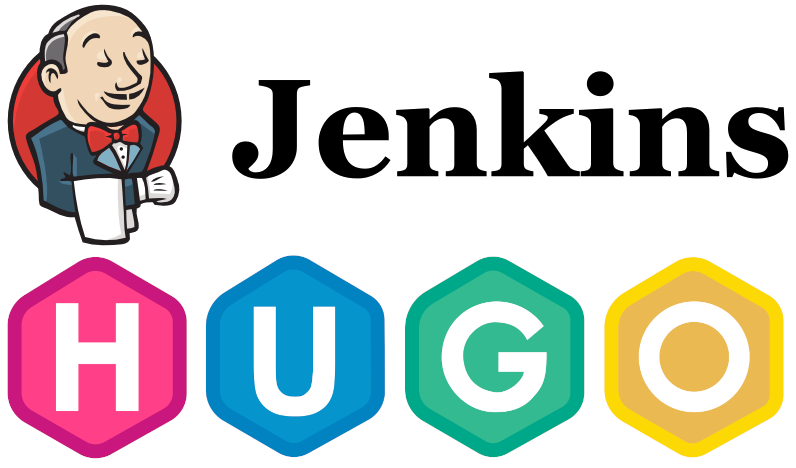

+++ 
draft = false
date = 2022-11-15T12:00:03+03:00
title = "Статический блог с автопубликацией: Jenkins+Hugo+Webhook relay"
description = ""
slug = ""
authors = []
tags = ["Jenkins","Hugo","Webhook relay"]
categories = []
externalLink = ""
series = []
+++



Aloha! 

Решил наконец-то завести небольшой блог, где буду оставлять для себя небольшие технические полезности: и первой записью будет о том, как это работает и почему так.

Во-первых, решил, что сайт будет статическим - и будет использоваться [HUGO](https://gohugo.io/) в качестве генератора страниц: мне надо будет только добавлять контент в [Markdown](https://www.markdownguide.org/)-разметке, а дальше одной командой можно сгенерировать нужные html. Это позволит держать все содержимое блога под системой контроля версия (и даже больше, на [гитхабе](https://github.com/imsavin/blog) будет постоянный бэкап!),  а статическое содержимое не требует ни интерпретора PHP, ни баз данных - и может хоститься на любой сущности, что умеет в HTTP - от простенького роутера, до S3-бакета и Github Pages.

Но мы -  инженеры, системные администраторы и девопсы - любим автоматизацию, и не любим после каждого изменения текста выполнять по куче действий, нужных лишь для того, чтобы обновить веб-страницы у нас на сайте. Тут нам и придет на помощь старый добрый [Jenkins](https://jenkins.io) - много его локальная установка не съест, а весь пайплайн у меня отрабатывает за несколько секунд от получения обновления до автозалива на сайт.   

Так что создал `Jenkinsfile` с таким содержимым:

```
pipeline {
    agent any

    stages {
        stage('git') {
            steps {
                git 'https://github.com/imsavin/blog.git'
                sh 'git submodule update --init'
                script {
                  env.GIT_COMMIT_MSG = sh (script: 'git log -1 --pretty=%B', returnStdout: true).trim()
                  currentBuild.displayName = "${GIT_COMMIT_MSG}"
                }
            }
        }
        stage('Build') {
            steps {
                sh '''hugo'''
            }
            
        }
        stage('Propagate') {
        steps {
        sshagent(credentials: ['ssh_blog_publish']) {
      sh '''
         rsync -oavz -e "ssh -A root@savin.org.ru ssh"  public/ $WWWUSER@10.8.0.2:/var/www/html/blog/
         ssh -J root@savin.org.ru $WWWUSER@10.8.0.2 chmod -R 755 /var/www/html/blog
      '''
   }
            }
        }
    }
}
```

Весьма простой, и скорее всего, далекий от идеального примера - но со своей ролью справляется. На `stage git` джоба получает свежую версию репозитория блога со всем содержимым, подкачивает сабмодули, так как тема Hugo включена через сабмодуль и отображет в названии джобы комментарий к последнему коммиту. На `stage Build` происходит магия генерации страниц - они уходят в директорию `./public`. `stage Propagate` отвечает за синхронизацию получивших артефактов в корневую директорию веб-сервера - в данном случает используется джампхост ssh, так как что веб-сервер расположен за бастионным. Можете выбрать любой удобный вам.

> В **.ssh/.known_hosts** должны быть указаны отпечатки и бастионного и веб-сервера, иначе джоба упадет с ошибкой

На этом моменте уже достаточно обновить репозиторий с сайтом и запустить билд в Дженкинсе для того, чтобы свежая версия оказалась уже в готовом виде на сайте: но это еще не конец - можно автоматизировать еще, чтобы джоба автоматически выполнялась после отправки изменений на GitHub. На GitHub подобное поведение реализовано через вебхуки репозитория, они дергаются после git push или иного любого изменения, которое настроите. Но есть один нюанс для работы им нужен публично разрешаемый адрес получателя хуков: и это не будет работать на моем ноутбке (за натом, в разъездах, то включен, то выключен, то вне сети)

Здесь  нам на помощь приходит сервис [Webhook Relay](https://webhookrelay.com/) - они предоставляют публичный адрес в виде *longalfanumericalstring.webhookrelay.com*, который нужно подставить в настройки вебхуков репозитория, и программу-агент, которая будет ретранлировать пришедшие хуки локально. Подробную [инструкцию](https://webhookrelay.com/v1/tutorials/github-webhooks-jenkins-vm.html) можно почитать у них на сайте - но кратко она сводится к регистрации вашего апи-токена и настройки релея командой `relay forward --bucket github-jenkins http://localhost:8080/github-webhook` 

После чего, в идеале, после вашего пуша в GitHub-репозиторий сборка должна производится автоматически по получению уведомления от гитхаба
